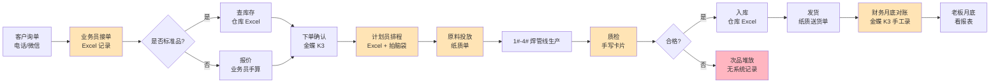
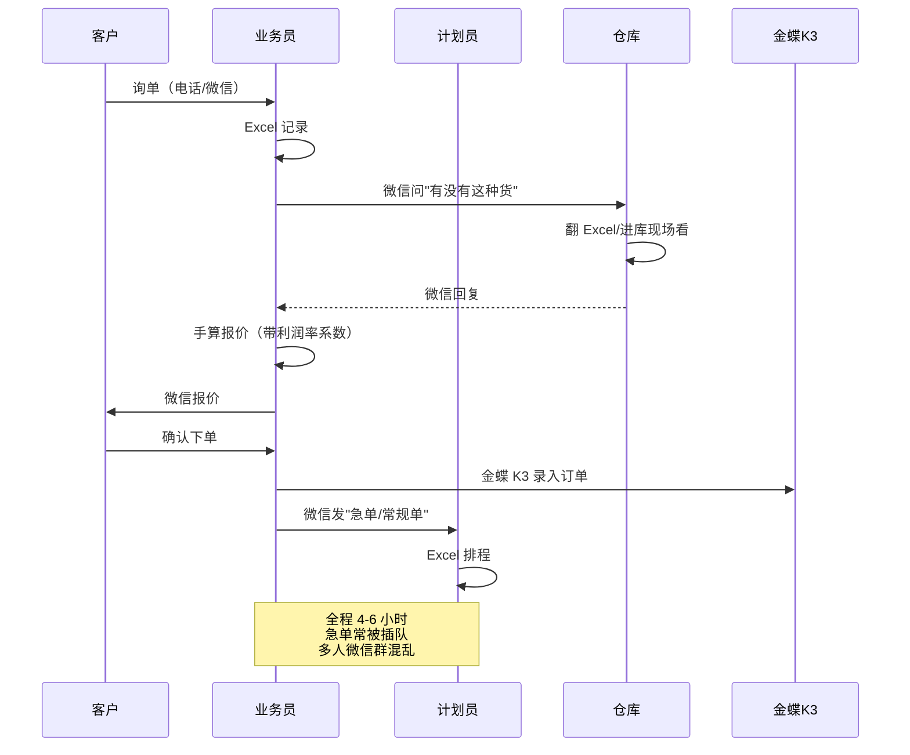
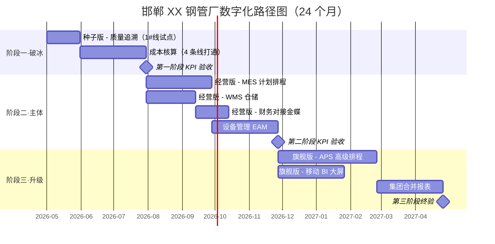

# 流程现状图 + 数字化路径图（标准案例）

> 这两份是 3 天工作坊后的核心交付物。  
> 案例对象：**邯郸 XX 钢管科技有限公司**（4 条焊管线，年产 18 万吨）  
> 用 Mermaid + ASCII 双重表达，便于在 PPT 里直接用 / 在白板上手画。

---

# 第一部分：流程现状图（As-Is）

## 1. 一图读懂全厂流程（顶层视图）



**图例说明**：
- 🟧 **黄色** = 数字化薄弱环节（用 Excel / 纸质）
- 🟥 **红色** = 数字化空白环节（无任何系统）
- ⬜ 白色 = 已数字化（金蝶 K3 / 仓库 Excel）

---

## 2. 17 个常见痛点命中表（销售现场逐一对勾）

| # | 痛点描述 | 是否命中 | 估算损失 |
|---|---|---|---|
| 1 | 询单到报价 > 4 小时 | ✅ | 每年丢单 50-100 个 |
| 2 | 排程靠经验，无系统辅助 | ✅ | 计划员加班 +50% |
| 3 | 急单插入打乱原计划 | ✅ | 月均 8-12 次延期 |
| 4 | 客户问进度查不到 | ✅ | 客户满意度低 |
| 5 | 卷号 / 炉号追溯靠手写 | ✅ | 索赔时无法举证 |
| 6 | 质检数据手写，无法分析 | ✅ | 次品率高于行业 1-2% |
| 7 | 不同产线成本不可比 | ✅ | 隐性损失 80-150 万/年 |
| 8 | 库存账实差 > 5% | ✅ | 呆滞料 > 8% |
| 9 | 盘点要 3 天 | ✅ | 占用人力大 |
| 10 | 财务月报 15 天后才出 | ✅ | 决策滞后 |
| 11 | 应收账款无预警 | ✅ | 坏账风险 |
| 12 | 设备故障无统计 | ✅ | 故障重复发生 |
| 13 | 设备保养靠记忆 | ✅ | 计划外停机多 |
| 14 | 工艺参数未记录 | ✅ | 质量波动追不到根因 |
| 15 | 老板不在厂看不到生产 | ✅ | 决策依赖电话 |
| 16 | 出问题靠开会扯皮 | ✅ | 责任不清 |
| 17 | 客户审厂无数据 | ✅ | 出口客户流失风险 |

> **17 个全部命中** —— 在我们 200+ 家钢厂调研中，命中 12 个以上属于"高潜力客户"。

---

## 3. 6 大业务域子流程图（细化版）

### 3.1 销售订单子流程（As-Is）



**痛点**：4 个角色 + 3 个工具（Excel、金蝶、微信），信息靠人传，遗漏率 15%+。

### 3.2 生产执行子流程（As-Is）

```
┌──────────┐  纸质生产单   ┌──────────┐  手抄  ┌──────────┐
│ 计划员    │ ───────────→ │ 班长发料  │ ────→ │ 焊管线    │
│ Excel     │              │ Excel    │        │ 操作工    │
└──────────┘              └──────────┘        └────┬─────┘
                                                    │ 班次记录本
                                                    ▼
                                              ┌──────────┐
                                              │ 质检员    │
                                              │ 卡片填写  │
                                              └────┬─────┘
                                                    │ 手写
                                                    ▼
                                              ┌──────────┐
                                              │ 月底统计  │
                                              │ 财务录入  │
                                              └──────────┘
```

**痛点**：从下达到统计 30 天延迟，错误率 8-12%，无法追溯到班次。

### 3.3 质量追溯子流程（As-Is）

```
┌─────────────────────────────────────────────┐
│  客户索赔 → 业务员 → 生产部 → 翻 30 天前的卡片  │
│                            ↓                  │
│                     找到 / 找不到（50/50）     │
│                            ↓                  │
│                     找到也无人能解释根因         │
└─────────────────────────────────────────────┘
```

**痛点**：去年 12 万元索赔事件，**3 天才找到那卷货**，无法定位班次/操作工/参数，最终全额赔付。

### 3.4 库存子流程（As-Is）

```
原料库 ──── 仓管员 Excel ────┐
                           │
半成品库 ── 班长 + 纸条 ────┼── 月底人工合并 → 财务
                           │
成品库 ──── 仓管员 Excel ────┘
```

**痛点**：3 套表互不相通；账实差 7-10%；月底盘点要 3 个仓 + 12 人 + 3 天。

### 3.5 成本核算子流程（As-Is）

```
┌─ 原料采购单（金蝶）   ┐
├─ 工资单（财务）      ├──→ 月底财务"凭经验分摊" → 全厂吨成本
├─ 电费单（手工）      │      （4 条线无法区分）
├─ 辅料（纸质）        │
└─ 设备折旧（手工）    ┘
```

**痛点**：1#-4# 线吨成本被"摊大饼"，每条线真实成本不可知，**做对/做错都不知道**。

### 3.6 设备管理子流程（As-Is）

```
设备故障 → 操作工喊班长 → 班长找维修工 → 修好 → 不记录
                                                  ↓
                                    没人知道这个故障是不是第 3 次发生
```

**痛点**：备件库存靠老员工记忆；故障重复率高；MTBF（平均故障间隔）算不出。

---

## 4. 流程现状的 5 句话总结（给老板看的版本）

> 在 PPT 第一页用大字写：

1. **17 个钢厂常见痛点全部命中**（行业平均 9-12 个）
2. **数据被困在 5 套不互通的工具里**（金蝶 + 仓库 Excel + 排程 Excel + 微信 + 纸质）
3. **从客户下单到老板看到结果，平均延迟 30 天**
4. **全厂"账上有的对不上账下，账下有的算不到成本"**
5. **隐性损失估算每年 200-350 万**（成本 80-150 + 索赔 30-50 + 呆滞 50-100 + 加班 20-40）

> **这 5 句话比 30 张图都管用** —— 直接戳老板的钱袋子。

---

# 第二部分：数字化路径图（To-Be）

## 1. 三阶段路径总览（一图）



> **关键节点 3 个**：
> - **M1（约 3 个月）**：质量追溯 + 成本核算见效，老板可看到首批数据
> - **M2（约 9 个月）**：MES + WMS + 财务联通，全厂数据可一屏看
> - **M3（约 18 个月）**：APS + BI 上线，进入"自动化决策"阶段

---

## 2. 阶段一：破冰（M0 → M3）

### 2.1 目标
- **不动现有金蝶**（保留客户已有投资）
- **3 个月内见效**（让老板有"赚到"感）
- **总投入 ≤ 3 万** + 月租 ≤ ¥4,000（**种子版**）

### 2.2 上线模块
| 模块 | 范围 | 见效指标 |
|---|---|---|
| 质量追溯（1#线试点） | 卷号扫码、班次绑定、参数记录 | 索赔追溯 ≤ 5 秒 |
| 成本自动化（4 条线） | 对接电费 + 原料 + 工时 | 4 条线吨成本可对比 |

### 2.3 现状 → 目标对比

| 项 | 现状 | 阶段一目标 |
|---|---|---|
| 卷号追溯 | 3 天找不到 | **5 秒查到** |
| 4 条线成本可比 | 不可比 | **每条线吨成本日报** |
| 数据延迟 | 30 天 | **当日** |

### 2.4 阶段一预期 ROI
- 投入：实施费 ¥3 万 + 月租 ¥3,500/月 × 3 月 ≈ **¥4 万**
- 收益：减少索赔 + 4 条线成本对标改善 ≈ **¥30-60 万 / 年**
- **3 个月回本**

---

## 3. 阶段二：主体（M3 → M9）

### 3.1 目标
- **从单点见效升级到全厂联通**
- 升级到**经营版**（实施费补差 ¥3.8 万 + 月租升至 ¥9,800/月）

### 3.2 上线模块
| 模块 | 范围 |
|---|---|
| MES 计划排程 | 4 条线 + 急单插入算法 + 进度可视 |
| WMS 仓储 | 3 仓打通 + 扫码出入库 + 自动盘点 |
| 财务对接金蝶 | 销售/采购/库存自动过账，月报从 15 天 → 5 天 |
| 设备管理 EAM | 4 条线设备点检 + 保养计划 + 备件管理 |

### 3.3 阶段二业务流程（To-Be）


**对比 As-Is**：从 17 个工具/纸质环节 → **1 个系统**贯穿。

### 3.4 阶段二预期 ROI（年化）
| 改善项 | 年节省 |
|---|---|
| 4 条线成本对标 | 80-150 万 |
| 减少索赔 + 出口客户保住 | 50-80 万 |
| 计划员加班 + 提效 | 10-20 万 |
| 库存呆滞优化 | 30-60 万 |
| 设备故障停机减少 | 20-40 万 |
| **合计** | **190-350 万 / 年** |

- 累计投入（M0-M9）：实施费 ¥6.8 万 + 月租 ¥9,800 × 9 月 = **¥15.6 万**
- 阶段二投资回收期：**4-6 个月**

---

## 4. 阶段三：升级（M9 → M18）

### 4.1 目标
- 从"信息化"升级到"智能化"
- 升级到**旗舰版**（实施费补差 ¥12 万 + 月租升至 ¥2.5 万）

### 4.2 上线模块
| 模块 | 范围 |
|---|---|
| APS 高级排程 | 多目标优化（交期 / 成本 / 设备效率） |
| 移动 BI 大屏 | 老板手机端实时看核心指标，多基地汇总 |
| 集团合并报表 | 自动生成集团合并、抵消、合并损益 |

### 4.3 阶段三业务能力跃升

| 能力 | 阶段二 | 阶段三 |
|---|---|---|
| 排程 | 系统辅助 | **AI 自动优化** |
| 决策 | 看数据再决策 | **数据预警→自动建议** |
| 客户审厂 | 一键导出报告 | **客户直接接 API 看** |
| 集团管控 | 单厂数据 | **多基地汇总 + 对标** |

### 4.4 阶段三 ROI（年化叠加）
- 进一步节省 100-200 万 / 年
- 更重要的是 **业务能力升级**：拿到原本拿不到的汽车 / 出口大客户

---

## 5. 三阶段总投入与回报（一页 ROI）

| 阶段 | 投入累计 | 年化收益 | 回报周期 |
|---|---|---|---|
| 阶段一（M0-M3） | ¥4 万 | ¥30-60 万 | **3 个月** |
| 阶段二（M3-M9） | ¥15 万 | ¥190-350 万 | **6 个月** |
| 阶段三（M9-M18） | ¥40 万 | ¥290-550 万 | **12 个月** |
| **24 月总计** | **¥40 万** | **首年节省 ¥190-350 万** | **总 ROI > 7 倍** |

> 给老板的一句话：**"投入 40 万，第一年就把利润提升 200 万以上，3 年累计回报 8-15 倍。"**

---

## 6. 关键里程碑老板视角看板

```
M0          M3          M6          M9          M12        M18
│           │           │           │           │           │
├─ 启动     ├─ 4 条线   ├─ MES      ├─ 全厂     ├─ 客户     ├─ APS
│           │  成本可比 │  排程上线  │  数据联通 │  审厂     │  自动
│           │           │           │           │  过审     │  优化
│           │  ★ 见效   │           │  ★ 见效   │           │  ★ 终验
│           │           │           │           │           │
└── 老板    └── 月度    └── 一周一  └── 日报    └── 实时    └── 手机
    看到    看到 4 线   会看数据    上看板      预警        BI 大屏
    "钱"    成本对比                                        多基地
```

---

## 7. 风险预案（写给老板看的"保险条款"）

| 风险 | 预案 |
|---|---|
| 阶段一 KPI 不达标 | **退月租 + 免后 3 月**（合同第五条） |
| 工人不会用 | 操作 80% 在扫码枪 / 平板上，3 天培训通过率 95% |
| 老员工抵触 | 阶段一只在 1#线试点，老员工不强迫 |
| 数据安全 | **本地部署**，数据不出厂；合同写明所有权归您 |
| 公司倒闭怎么办 | 数据格式开放（MySQL），任何技术团队都能接管 |

---

# 附录：工作坊交付物清单

3 天工作坊结束后，必须交付以下材料给老板：

- [ ] PPT 1：流程现状图（含 17 痛点命中表 + 5 句话总结）—— 30 页内
- [ ] PPT 2：数字化路径图（含 3 阶段 + ROI 测算）—— 25 页内
- [ ] PDF：流程现状图原图（高清，老板可打印贴墙）
- [ ] Excel：17 痛点 ROI 测算表（每个痛点对应年损失估算）
- [ ] Word：3 个月内行动建议（哪些可以自己改、哪些需要系统）
- [ ] 1 张 A1 大图：3 阶段路径图，可直接贴在老板办公室

> 这些材料**全部免费**，即使客户不签合同，也带走价值满满。  
> 这是我们建立"行业专家"形象的最佳方式 —— **服务即营销**。
